# Pipeline Architecture — Goat Tips ML

## Diagrama Completo: EDA → Modeling → Serving

```mermaid
flowchart TD

    %% ─────────────────────────────────────────────
    %% ZONA 1 — INGESTÃO DE DADOS
    %% ─────────────────────────────────────────────
    subgraph INGESTION["① INGESTÃO — BetsAPI"]
        direction TB
        API["BetsAPI\nLeague ID: 94"]
        API -->|"4.585 jogos"| EV["events.csv\n(times, placar, árbitro, estádio, posição)"]
        API -->|"86.554 linhas"| ST["stats.csv\n(shots, corners, possession, attacks por período)"]
        API -->|"229.549 linhas"| TL["timeline.csv\n(gol/cartão × minuto)"]
        API -->|"4.548.239 linhas"| OD["odds.csv\n(1X2 · O/U · BTTS × tempo)"]
        API -->|"35 times"| TM["teams.csv"]
        API -->|"classificação"| TB["table.csv"]
    end

    %% ─────────────────────────────────────────────
    %% ZONA 2 — ARMAZENAMENTO
    %% ─────────────────────────────────────────────
    subgraph STORAGE["② ARMAZENAMENTO"]
        direction LR
        CSV["CSV Local\n(RAM cache via pandas\nlru_cache)"]
        SUP["Supabase PostgreSQL\nevents · match_stats\ntimeline · odds_snapshots\nteams · sync_log"]
        BLOB["Azure Blob Storage\npoisson_model.pkl"]
    end

    EV & ST & TL & TM & TB -->|"in-memory"| CSV
    EV & ST & TL & TM -->|"upsert diário\n03:00 UTC"| SUP
    OD -->|"local only\n563 MB"| CSV

    %% ─────────────────────────────────────────────
    %% ZONA 3 — EDA
    %% ─────────────────────────────────────────────
    subgraph EDA["③ EDA — Análise Exploratória"]
        direction TB
        EDA1["Distribuição de gols\npor minuto (6 buckets)"]
        EDA2["Distribuição de cartões\npor minuto"]
        EDA3["Taxa BTTS / Clean Sheet\npor time"]
        EDA4["Forma recente\n(últimos 10 jogos)"]
        EDA5["H2H histórico\n(qualquer par de times)"]
        EDA6["Artilheiros & Assistências\n(toplist API)"]
        EDA7["📋 TODO: Calibração\nBrier score vs odds mercado"]
        EDA8["📋 TODO: EDA odds timeseries\nmovimentação de linha\nsmart money detector"]
    end

    CSV --> EDA1 & EDA2 & EDA3 & EDA4 & EDA5 & EDA6
    OD -->|"563 MB"| EDA7 & EDA8

    %% ─────────────────────────────────────────────
    %% ZONA 4 — FEATURE ENGINEERING
    %% ─────────────────────────────────────────────
    subgraph FEATURES["④ FEATURE ENGINEERING"]
        direction TB

        subgraph FEAT_CURRENT["✅ Implementado"]
            F1["attack_strength · defense_strength\n(por time, normalizado)"]
            F2["league_avg_home_goals\nleague_avg_away_goals"]
            F3["win_rate · draw_rate\navg_goals_for · avg_goals_against"]
            F4["btts_rate · clean_sheet_rate"]
            F5["momentum_score\n(shots + attacks + corners)"]
            F6["goal_risk_score (0-10)\ncard_risk_score (0-10)"]
        end

        subgraph FEAT_TODO["📋 TODO — Features Não Implementadas"]
            FT1["⏱ Time-decay weight\nexp(-ξ × ΔT) por partida"]
            FT2["🏟 Home advantage γ\nparâmetro explícito no modelo"]
            FT3["🎯 xG por chute\nshots_on_goal / shots_total\n× dangerous_attacks"]
            FT4["🟨 Referee bias\nmédia cartões por árbitro"]
            FT5["📊 League position gap\nmotivação / relevância do jogo"]
            FT6["📈 Odds movement\nabertura vs fechamento\nsignal de dinheiro inteligente"]
            FT7["🔴 Red card flag\ntime com 10 jogadores"]
            FT8["⚽ Lineup quality score\ntitulares vs reservas"]
            FT9["📅 Days since last match\nfadiga / fixture congestion"]
        end
    end

    EDA1 & EDA2 & EDA3 & EDA4 --> FEAT_CURRENT
    EDA7 & EDA8 --> FEAT_TODO

    %% ─────────────────────────────────────────────
    %% ZONA 5 — MODELAGEM
    %% ─────────────────────────────────────────────
    subgraph MODELING["⑤ MODELAGEM"]
        direction TB

        subgraph MODEL_CURRENT["✅ Modelo Atual"]
            M1["Poisson Independente\nDixon-Coles 1997\n(sem rho, sem time-decay)"]
            M1 --> M1OUT["λ_home · λ_away\nMatriz 7×7 de placares\nHome/Draw/Away · O2.5 · BTTS\nTop 5 placares · Confiança"]
        end

        subgraph MODEL_FIX["🔧 Correções Prioritárias"]
            MF1["Dixon-Coles + ρ\ncorreção para baixo score\n(0-0, 1-0, 0-1, 1-1)"]
            MF2["Exponential time-decay\npesos recentes > histórico"]
            MF3["Home advantage γ\nparâmetro explícito"]
        end

        subgraph MODEL_NEXT["📋 Próximos Modelos"]
            MN1["xG-based Poisson\nlambda via expected goals\nem vez de gols reais"]
            MN2["Bivariate Poisson\ncorrelação entre gols\ncasa vs visitante"]
            MN3["Bayesian Hierarchical\n(PyMC / Stan)\nmelhor para times novos\nincerteza calibrada"]
            MN4["In-Play Model\n(xGBoost / LightGBM)\npredição live com estado\ndo jogo (min, placar, stats)"]
            MN5["Gradient Boosting\n(todas as features juntas)\ncaptura não-linearidades"]
        end
    end

    FEAT_CURRENT --> MODEL_CURRENT
    FT1 & FT2 & FT3 --> MODEL_FIX
    MODEL_FIX --> MODEL_NEXT
    FEAT_TODO --> MODEL_NEXT

    %% ─────────────────────────────────────────────
    %% ZONA 6 — AVALIAÇÃO / MLOPS
    %% ─────────────────────────────────────────────
    subgraph MLOPS["⑥ AVALIAÇÃO & MLOps"]
        direction TB

        subgraph MLOPS_CURRENT["✅ Implementado"]
            ML1["Retrain semanal\n(toda segunda 03:00 UTC)"]
            ML2["Fallback chain\nlocal pkl → Blob → inline fit"]
            ML3["joblib serialize\npoisson_model.pkl"]
        end

        subgraph MLOPS_TODO["📋 TODO — MLOps Gaps"]
            MLT1["📊 Prediction logging\n(salvar predição + outcome real)\npara calcular Brier score"]
            MLT2["🔄 Model versioning\nnão sobrescrever pkl antigo\n(v1, v2, v3...)"]
            MLT3["⚖ A/B testing\ncomparar versões no tráfego live"]
            MLT4["📉 Drift detection\nperformance degrada silenciosamente"]
            MLT5["🧪 Evaluation pipeline\nautomático: modelo novo >= baseline"]
            MLT6["📡 MLflow / W&B\nexperiment tracking"]
        end
    end

    MODEL_CURRENT --> MLOPS_CURRENT
    MODEL_NEXT --> MLOPS_TODO

    %% ─────────────────────────────────────────────
    %% ZONA 7 — DADOS SENDO PERDIDOS (DESTAQUE)
    %% ─────────────────────────────────────────────
    subgraph LOST["⚠ DADOS SENDO PERDIDOS AGORA"]
        direction TB
        L1["stats_trend live\n(fetched mas nunca persistido)\n→ perdemos dataset in-play"]
        L2["narrative GPT-4.1\n(gerado mas nunca salvo)\n→ impossível avaliar qualidade"]
        L3["Q&A do /ask\n(perguntas dos usuários perdidas)\n→ sinal mais valioso de UX"]
        L4["Raw BetsAPI response\n(sem log)\n→ impossível auditar predições"]
        L5["odds.csv timeseries\n4.5M linhas nunca usadas\n→ sharp money signal ignorado"]
    end

    ST -->|"não salvo em live"| L1
    OD -->|"não explorado"| L5

    %% ─────────────────────────────────────────────
    %% ZONA 8 — SERVING / AGENT
    %% ─────────────────────────────────────────────
    subgraph SERVING["⑦ SERVING — LangGraph Agent"]
        direction LR

        subgraph AGENT_CURRENT["✅ Agent Atual (3 nós sequenciais)"]
            A1["fetch_context_node\n(BetsAPI paralelo)"]
            A2["fetch_historical_node\n(CSV + Poisson)"]
            A3["generate_narrative_node\n(GPT-4.1 PT)"]
            A1 --> A2 --> A3
        end

        subgraph AGENT_TODO["📋 TODO — Agent Melhorias"]
            AT1["Tool Use para /ask\nLLM chama BetsAPI diretamente"]
            AT2["Reflection node\ncheca alucinação + consistência"]
            AT3["Streaming response\nLangGraph event streaming"]
            AT4["Agent Memory\nhistórico de predições por jogo"]
            AT5["Parallel branches\nBetsAPI ∥ Analytics ∥ Odds"]
        end
    end

    MLOPS_CURRENT --> BLOB
    BLOB --> A2
    SUP --> A2
    CSV --> A2

    %% ─────────────────────────────────────────────
    %% CONEXÕES FINAIS
    %% ─────────────────────────────────────────────
    A3 -->|"FullMatchAnalysis"| OUT["API Response\n/predictions/{id}/full-analysis"]

    MLOPS_TODO --> AGENT_TODO

    %% ─────────────────────────────────────────────
    %% ESTILOS
    %% ─────────────────────────────────────────────
    classDef current fill:#1a472a,stroke:#2d6a4f,color:#fff
    classDef todo fill:#1a1a2e,stroke:#4a4e69,color:#adb5bd
    classDef lost fill:#4a1522,stroke:#c1121f,color:#fff
    classDef data fill:#0d3b66,stroke:#1b6ca8,color:#fff
    classDef api fill:#2d0057,stroke:#7b2d8b,color:#fff
    classDef output fill:#1b3a4b,stroke:#0096c7,color:#fff

    class M1,M1OUT,ML1,ML2,ML3,F1,F2,F3,F4,F5,F6,A1,A2,A3,EDA1,EDA2,EDA3,EDA4,EDA5,EDA6 current
    class MF1,MF2,MF3,MN1,MN2,MN3,MN4,MN5,FT1,FT2,FT3,FT4,FT5,FT6,FT7,FT8,FT9,MLT1,MLT2,MLT3,MLT4,MLT5,MLT6,AT1,AT2,AT3,AT4,AT5,EDA7,EDA8 todo
    class L1,L2,L3,L4,L5 lost
    class EV,ST,TL,OD,TM,TB,CSV,SUP,BLOB data
    class API api
    class OUT output
```



---

## Legenda

| Cor | Significado |
|-----|-------------|
| 🟢 Verde escuro | Já implementado e funcionando |
| 🔵 Azul escuro | Dados / armazenamento |
| 🟣 Roxo | Fonte externa (BetsAPI) |
| ⚫ Cinza azulado | TODO — próxima iteração |
| 🔴 Vermelho | Dados sendo perdidos agora |
| 🩵 Azul claro | Output / resposta da API |

---

## Roadmap Resumido

```
AGORA (bugs/fixes rápidos)
  └─ Poisson + rho correction
  └─ Time-decay weights
  └─ Home advantage γ explícito
  └─ Persistir narrativas + predictions no DB

PRÓXIMO SPRINT
  └─ xG-based lambda (usar shots/attacks do stats.csv)
  └─ Referee feature
  └─ Persistir stats_trend live → dataset in-play
  └─ LLM tool use no /ask
  └─ Streaming no /full-analysis

MÉDIO PRAZO
  └─ Bayesian Hierarchical Model (PyMC)
  └─ Odds movement feature (explorar os 4.5M rows)
  └─ Model versioning + evaluation pipeline
  └─ In-play prediction model (estado do jogo ao vivo)

LONGO PRAZO
  └─ Multi-agent com memória
  └─ xG from shot location (StatsBomb data)
  └─ Fine-tuning do LLM com narrativas salvas
  └─ A/B testing de modelos em produção
```
